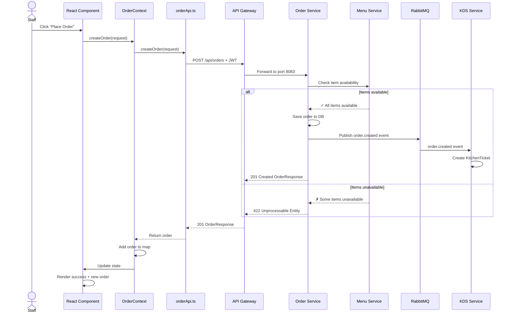
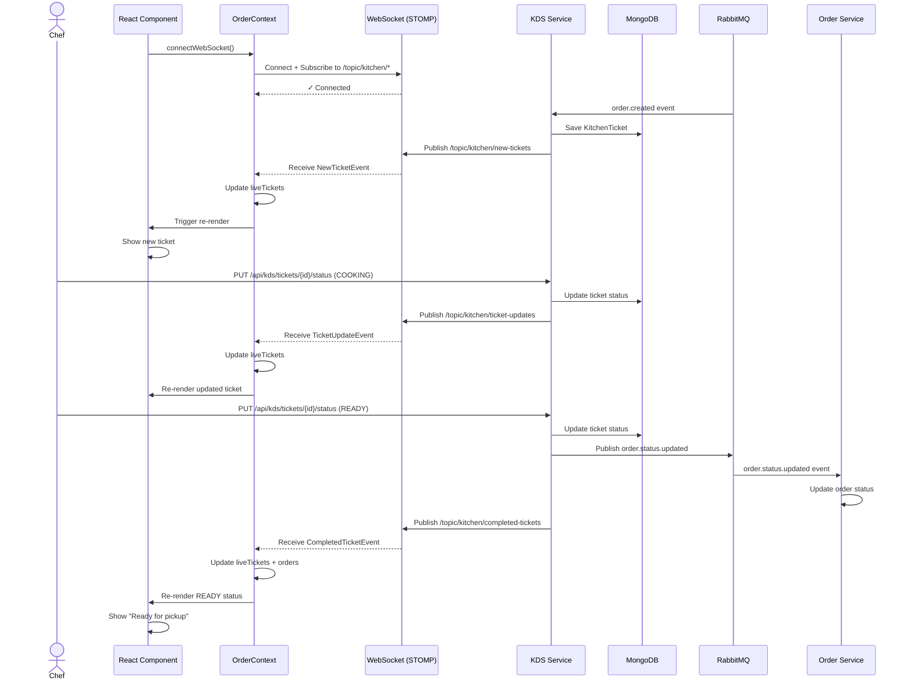

# Architecture & Data Flow Diagrams

## 📐 System Architecture

```
┌─────────────────────────────────────────────────────────────────────┐
│                         FRONTEND (React)                            │
│                                                                     │
│  ┌──────────────────┐         ┌──────────────────┐                 │
│  │  OrderProvider   │◄───────│  AuthProvider    │                 │
│  │  (OrderContext)  │         │                  │                 │
│  └────────┬─────────┘         └──────────────────┘                 │
│           │                                                         │
│  ┌────────▼─────────────────────────────────────────────────┐      │
│  │          Components (useOrder, useOrderForm)             │      │
│  │                                                           │      │
│  │  ┌─────────────┐  ┌──────────────┐  ┌────────────────┐  │      │
│  │  │ OrderForm   │  │ OrderMonitor │  │ Dashboard      │  │      │
│  │  └─────────────┘  └──────────────┘  └────────────────┘  │      │
│  └───────┬──────────────────────┬────────────────┬──────────┘      │
│          │                      │                │                  │
└──────────┼──────────────────────┼────────────────┼──────────────────┘
           │                      │                │
        [REST]              [REST]             [WebSocket]
           │                      │                │
┌──────────┼──────────────────────┼────────────────┼──────────────────┐
│          │                      │                │                  │
│  ┌───────▼────────┐  ┌──────────▼──────┐  ┌─────▼──────┐          │
│  │ API Gateway    │  │ API Gateway     │  │   KDS      │          │
│  │  /api/auth     │  │  /api/orders    │  │   Service  │          │
│  │  /api/menu     │  │  /api/kds       │  │ (STOMP)    │          │
│  └────────────────┘  └─────────────────┘  └────────────┘          │
│                                                                     │
│                   API Gateway (Port 8080)                          │
└────────────────────────────────────────────────────────────────────┘
           │                      │                │
        ┌──┴────────┐         ┌───┴──────┐      ┌─┴──────┐
        │            │         │          │      │        │
   ┌────▼──┐  ┌─────▼──┐  ┌──▼────┐  ┌──▼─┐  ┌─▼─┐  ┌──▼─────┐
   │  Auth  │  │ Menu   │  │Order  │  │KDS │  │MongoDB     │ 
   │Service │  │Service │  │Service│  │Srvc│  │(Kitchen)   │
   │(8081)  │  │(8082)  │  │(8083) │  │(80)│  └────────────┘
   └────┬───┘  └────┬───┘  └───┬───┘  └────┘
        │           │           │
   ┌────▼────┐  ┌───▼────┐  ┌──▼───┐
   │PostgreSQL   │PostgreSQL    │RabbitMQ│
   │(users)  │  │(menu,orders) │(events)│
   └─────────┘  └──────────┘  └────────┘
```

## 🔄 Order Creation Flow (REST)



## 📡 Real-time WebSocket Flow



## 🔗 Component Hierarchy

```
App
├── AuthProvider
│   └── OrderProvider
│       ├── OrderManagementExample
│       │   ├── CreateOrderForm
│       │   │   └── useOrderForm()
│       │   │       ├── submitOrder()
│       │   │       ├── addItem()
│       │   │       └── removeItem()
│       │   │
│       │   └── OrderMonitor
│       │       └── useOrder()
│       │           ├── orders Map
│       │           ├── liveTickets Map
│       │           ├── wsConnected status
│       │           └── getOrdersByStatus()
│       │
│       └── [Other Components]
│           └── useOrder()
│               └── All order data/actions
```

## 🎯 State Management Flow

```
┌─────────────────────────────────────────────┐
│          OrderContext (Redux-like)          │
├─────────────────────────────────────────────┤
│ State:                                      │
│  ├─ orders: Map<number, OrderResponse>     │
│  ├─ liveTickets: Map<string, TicketEvent>  │
│  ├─ isLoading: boolean                     │
│  ├─ error: string | null                   │
│  └─ wsConnected: boolean                   │
├─────────────────────────────────────────────┤
│ Actions:                                    │
│  ├─ createOrder()           ──┐             │
│  ├─ fetchAllOrders()        ──┼─→ REST API │
│  ├─ fetchOrderById()        ──┘             │
│  ├─ getOrdersByStatus()     ──┐             │
│  ├─ getOrdersByTable()      ──┼─→ Filter   │
│  ├─ clearError()            ──┘             │
│  ├─ connectWebSocket()      ──┐             │
│  └─ disconnectWebSocket()   ──┼─→ WebSocket│
└─────────────────────────────────────────────┘
          ▲                  │
          │                  ▼
      useOrder()         Components
         Hook          Re-render on
                        state change
```

## 📊 Data Model Relationships

```
Order (Relational DB - PostgreSQL)
├─ id: number
├─ tableNumber: string
├─ staffName: string
├─ status: 'CREATED' | 'COOKING' | 'READY' | 'SERVED'
├─ timestamp: string
└─ items: OrderItem[]
   ├─ id: number
   ├─ menuItemId: string
   ├─ name: string
   ├─ quantity: number
   └─ customizations: string[]

KitchenTicket (NoSQL - MongoDB)
├─ id: string (same as Order.id)
├─ tableNumber: number
├─ waiterId: string
├─ status: 'PENDING' | 'COOKING' | 'READY' | 'SERVED'
├─ receivedAt: string
├─ completedAt: string (optional)
└─ items: KitchenTicketItem[]
   ├─ menuItemId: string
   ├─ itemName: string
   ├─ quantity: number
   ├─ status: string
   ├─ customizations: string[]
   └─ notes: string[]
```

## 📈 Message Flow - Create Order to Kitchen Display

```
┌─────────────────────────────────────────────────────────────────┐
│ Step 1: Order Submission (HTTP REST - Synchronous)             │
├─────────────────────────────────────────────────────────────────┤
│ Browser: POST /api/orders (with JWT)                           │
│         └─→ Order saved to PostgreSQL                          │
│             └─→ Response: 201 Created with OrderResponse       │
│                 └─→ useOrder() updates local state             │
└─────────────────────────────────────────────────────────────────┘

┌─────────────────────────────────────────────────────────────────┐
│ Step 2: Backend Event Publication (RabbitMQ - Async)           │
├─────────────────────────────────────────────────────────────────┤
│ Order Service: Publishes "order.created" event                 │
│              └─→ RabbitMQ exchanges to KDS service             │
└─────────────────────────────────────────────────────────────────┘

┌─────────────────────────────────────────────────────────────────┐
│ Step 3: Kitchen Ticket Creation (Internal)                     │
├─────────────────────────────────────────────────────────────────┤
│ KDS Service: Consumes "order.created" event                    │
│            └─→ Creates KitchenTicket in MongoDB                │
│                └─→ Ticket ready to broadcast                   │
└─────────────────────────────────────────────────────────────────┘

┌─────────────────────────────────────────────────────────────────┐
│ Step 4: WebSocket Broadcast (STOMP - Real-time)                │
├─────────────────────────────────────────────────────────────────┤
│ KDS Service: Publishes to /topic/kitchen/new-tickets           │
│            └─→ STOMP broker sends to all subscribed clients    │
│                └─→ Browser receives NewTicketEvent             │
│                    └─→ OrderContext updates liveTickets        │
│                        └─→ React re-renders                    │
│                            └─→ ✨ Kitchen display shows ticket │
└─────────────────────────────────────────────────────────────────┘

⏱️ Total time: ~100-500ms (depending on network & backend)
   ✓ No page refresh required
   ✓ Real-time update for all connected clients
   ✓ Automatic reconnection if WebSocket disconnects
```

## 🔐 Authentication & Authorization Flow

```
┌────────────────────────────────────────────────────────┐
│ 1. Login                                               │
├────────────────────────────────────────────────────────┤
│ POST /api/auth/login                                  │
│ {username, password}                                  │
│   └─→ Returns JWT token                              │
│       └─→ Stored in localStorage                     │
└────────────────────────────────────────────────────────┘

┌────────────────────────────────────────────────────────┐
│ 2. All API Requests                                    │
├────────────────────────────────────────────────────────┤
│ Authorization: Bearer <JWT_TOKEN>                     │
│ + Content-Type: application/json                      │
│   └─→ API Gateway validates JWT                       │
│       └─→ Routes to correct service                   │
│           └─→ Service checks role/permissions        │
└────────────────────────────────────────────────────────┘

┌────────────────────────────────────────────────────────┐
│ 3. Token Expiry Handling                              │
├────────────────────────────────────────────────────────┤
│ If 401 Unauthorized:                                  │
│   └─→ Clear token from localStorage                   │
│       └─→ Redirect to login                          │
│           └─→ User logs in again                     │
└────────────────────────────────────────────────────────┘
```

## 🌐 WebSocket Connection Lifecycle

```
┌─────────────────────────────────────┐
│ App Component Mounts                 │
│ useWebSocket({autoConnect: true})   │
└──────────────┬──────────────────────┘
               │
         ┌─────▼─────┐
         │ Connecting │
         └─────┬─────┘
               │
         ┌─────▼──────────────┐
         │ STOMP Handshake    │
         │ /ws/kds endpoint   │
         └─────┬──────────────┘
               │
         ┌─────▼────────────────────────────────┐
         │ Connected ✓                          │
         │ Subscribe to 3 topics:              │
         │ ├─ /topic/kitchen/new-tickets      │
         │ ├─ /topic/kitchen/ticket-updates   │
         │ └─ /topic/kitchen/completed-tickets│
         └─────┬────────────────────────────────┘
               │
      ┌────────┴────────┐
      │                 │
   (active)         (error/disconnect)
      │                 │
      │            ┌────▼──────────────┐
      │            │ Retry Logic        │
      │            │ (max 5 attempts)   │
      │            │ exp backoff: 3s    │
      │            └────┬───────────────┘
      │                 │
      │            ┌────▼──────────┐
      │            │ Connected ✓   │
      │            │ or Failed ✗   │
      │            └────┬──────────┘
      │                 │
      └─────────┬───────┘
                │
        ┌───────▼────────┐
        │ Listening for  │
        │ Events...      │
        │ ✓ Messages     │
        │ ✓ Updates      │
        └────────┬───────┘
                 │
        (component unmounts)
                 │
        ┌────────▼──────────┐
        │ Disconnect        │
        │ Unsubscribe all   │
        │ Close connection  │
        └───────────────────┘
```

---

**Note**: These diagrams represent the complete flow of the real-time order system with WebSocket integration.
